<div align="center">


<a href="https://github.com/joshuaraja1"></a>

<br/><br/>

<a href="https://www.utdallas.edu/"></a>
<a href="https://www.google.com/maps/place/Dallas,+TX"></a>

<br/><br/>

<a href="https://joshraja.vercel.app/"></a>
<a href="https://www.linkedin.com/in/joshraja/"></a>
<a href="mailto:Joshua.Raja.654@gmail.com"></a>
<a href="https://github.com/joshuaraja1"></a>

<br/><br/>

<a href="https://github.com/joshuaraja1"></a>
<a href="https://github.com/joshuaraja1?tab=followers"></a>
<a href="https://github.com/joshuaraja1?tab=stars"></a>

</div>

<br/>

---

## About

I am a software engineer and AI/ML builder pursuing an M.S. in Business Analytics and AI at UT Dallas. I build across the stack—from data pipelines and backend services to the interfaces people use to make decisions.

My work includes production data integrations, applied machine learning, retrieval-based AI systems, and full-stack products. I care about clear architecture, measurable outcomes, and shipping tools that solve concrete problems.

I bring a product mindset to engineering: understand the user, make the system dependable, and measure whether the result actually helps.

**Open to:** Software Engineering · AI/ML Engineering · Backend and Data Engineering · Product-minded collaborations

---

## Tech Stack

### Languages

<a href="https://www.python.org/"></a>

### Frontend

<a href="https://react.dev/"></a>

### Backend & Databases

<a href="https://fastapi.tiangolo.com/"></a>

### Cloud, DevOps & Tooling

<a href="https://aws.amazon.com/"></a>

---

## AI / ML Expertise

| Domain | Proficiency | Details |
| :--- | :--- | :--- |
| Applied machine learning | Production experience | Forecasting, segmentation, anomaly detection, churn ranking, and model evaluation |
| Data engineering | Production experience | Batch and streaming pipelines, ETL, data-quality checks, SQL, and API integrations |
| LLM applications | Project experience | Multi-agent workflows, retrieval-augmented generation, and structured outputs |
| Recommendation systems | Project experience | Natural-language preferences, vector search, and constraint-aware ranking |
| Computer vision | Project experience | OpenCV, video processing, and optional YOLO-based detection pipelines |

---

## Featured Projects

<details>
<summary><strong>RideIQ — Natural-Language Vehicle Discovery</strong></summary>

<br/>

> Vehicle search that turns conversational preferences into ranked, explainable recommendations.

| Attribute | Detail |
| :--- | :--- |
| Stack | Next.js · TypeScript · PostgreSQL · pgvector · Supabase |
| Scale | Repository documents a 47,000-model dataset and approximately 60,000 synthetic listings |
| Performance | Vector-indexed retrieval with progressive constraint relaxation; no published latency benchmark |
| Security | Supabase authentication and row-level security documented in the repository |
| Impact | First place, Toyota Mobility Challenge at TAMUhack 2026 |
| Repository | [github.com/joshuaraja1/HackTamu2026](https://github.com/joshuaraja1/HackTamu2026) |

RideIQ combines semantic search with explicit constraints so that a useful result can still be returned when a buyer's initial requirements are too narrow. The design keeps the recommendation logic inspectable rather than presenting a black-box match.

</details>

<details>
<summary><strong>FinanceIQ — Multi-Agent Financial Analysis</strong></summary>

<br/>

> A six-agent workflow for researching and synthesizing financial information.

| Attribute | Detail |
| :--- | :--- |
| Stack | Python · FastAPI · React · PostgreSQL |
| Scale | Six specialized agents; no published usage count |
| Performance | No public latency or accuracy benchmark |
| Security | Security controls should be reviewed before production use |
| Impact | Fifth place, Goldman Sachs AI Challenge |
| Repository | [github.com/joshuaraja1/financeiq](https://github.com/joshuaraja1/financeiq) |

FinanceIQ explores how agent specialization can organize research and analysis into a clearer workflow. The public repository demonstrates the architecture; the competition result is an achievement, not a claim of production deployment.

</details>

<details>
<summary><strong>EchoTrace — Fleet Incident Evidence Reconstruction</strong></summary>

<br/>

> An evidence-focused MVP for reviewing commercial fleet incidents across video and case records.

| Attribute | Detail |
| :--- | :--- |
| Stack | Next.js · OpenCV · FFmpeg · optional YOLO · Azure adapters |
| Scale | MVP; no published production volume |
| Performance | No published model accuracy or processing benchmark |
| Security | Owner-scoped investigations, authenticated access, SHA-256 evidence fingerprints, and audited corrections |
| Impact | Brings source evidence and investigation notes into one review workflow |
| Repository | [github.com/joshuaraja1/EchoTrace](https://github.com/joshuaraja1/EchoTrace) |

EchoTrace is built around traceability: an investigator can connect a conclusion to the underlying evidence and preserve a record of later corrections. Its public documentation explicitly treats performance and operational metrics as unvalidated.

</details>

<details>
<summary><strong>Nebula Labs — Academic Discovery Platform</strong></summary>

<br/>

> A full-stack academic discovery project bringing course and professor information into a single interface.

| Attribute | Detail |
| :--- | :--- |
| Stack | Next.js · React · TypeScript · Go · MongoDB |
| Scale | Multi-source academic data; no verified usage count for this public derivative |
| Performance | No published benchmark for this repository |
| Security | Review authentication and data handling before production use |
| Impact | Makes academic information easier to explore and compare |
| Repository | [github.com/joshuaraja1/Nebula-Labs](https://github.com/joshuaraja1/Nebula-Labs) |

This repository is an independent derivative of MIT-licensed UTDNebula work, as documented in its README. It showcases full-stack implementation without claiming that this derivative is the official production service.

</details>

---

## Experience

### Machine Learning Engineer — Weboni

`January 2026 – Present`

Building production credit-risk decisioning, inference, and model-monitoring systems.

Scope of work:

- Designed and deployed a multi-client credit-risk decisioning pipeline processing 250,000+ scoring events daily across application, prescreening, portfolio-monitoring, and cross-sell eligibility workflows.
- Built FastAPI inference services on AWS with schema validation, audit logging, PII controls, and automated deployment, supporting real-time and batch-scoring workloads under a 99.95% service objective.
- Developed data-quality and model-monitoring checks for schema drift, anomalous inputs, and prediction distributions, reducing recurring production data-quality defects by 82%.
- Implemented and evaluated an XGBoost fraud-detection model, achieving 97% recall at a 2% false-positive rate on the approved evaluation dataset.
- Partnered with product, risk, compliance, and engineering stakeholders to translate policy requirements into explainable model outputs, reason codes, monitoring thresholds, and release criteria.

`Python` `FastAPI` `XGBoost` `pandas` `PostgreSQL` `Kafka` `AWS` `Docker` `GitHub Actions` `Grafana` `Prometheus`

### Software Engineer — Weboni

`January 2025 – December 2025`

Developed services and delivery infrastructure for a microservices-based loan-origination platform.

Scope of work:

- Developed services for a microservices-based loan-origination platform processing 200,000+ daily API and workflow events, reducing average processing time from 24 hours to 4 hours.
- Implemented serverless services with AWS Lambda and API Gateway, reducing infrastructure cost by 40% while supporting variable client traffic.
- Built Grafana and Prometheus dashboards covering 50+ service, data, and reliability metrics, reducing incident-detection time by 70%.
- Improved release pipelines through automated tests, quality gates, and deployment checks, increasing deployment throughput by 40% while enabling repeatable, lower-risk rollbacks.

`Java` `Python` `TypeScript` `React` `Angular` `Node.js` `REST APIs` `PostgreSQL` `Redis` `AWS` `Docker` `CI/CD`

### Data Science Intern — Renuity

`September 2024 – December 2024`

Built customer-data pipelines, predictive analysis, and decision dashboards.

Scope of work:

- Built a customer-churn pipeline with Python, SQL, pandas, and scikit-learn, achieving 83% precision and supplying prioritized customer segments to retention stakeholders.
- Automated Airflow and AWS Lambda ETL workflows processing 50,000+ customer records daily, reducing pipeline runtime from two hours to 15 minutes.
- Developed Streamlit, Plotly, and Tableau dashboards for churn, customer segmentation, and anomaly analysis, cutting recurring manual reporting time by 50%.

`Python` `SQL` `pandas` `scikit-learn` `XGBoost` `Airflow` `PostgreSQL` `AWS Lambda` `Tableau` `Streamlit` `Plotly`

### Software Engineer Intern — Weboni

`May 2024 – August 2024`

Developed APIs, testing, authentication, and monitoring for a loan-application workflow.

Scope of work:

- Developed REST APIs for a loan-application workflow handling 50,000+ daily requests; improved response time by 40% through query optimization and Redis caching.
- Added Jest and Cypress unit and integration tests, increasing coverage to 85% and reducing post-deployment defects by 40%.
- Implemented OAuth 2.0/JWT authentication and Prometheus/Grafana monitoring for secure access and faster incident diagnosis.

`Java` `JavaScript` `React` `REST APIs` `SQL` `PostgreSQL` `Redis` `Docker` `Jest` `Cypress` `Git` `CI/CD`

### Software Engineer — Nebula Labs

`August 2023 – May 2024`

Built full-stack university records software across interface, service, and data layers.

Scope of work:

- Built full-stack features for a university records platform serving 2,000+ active users using React, Go, Python, and PostgreSQL.
- Reduced average query latency from 500 ms to 80 ms through indexing, query-plan analysis, and schema changes.
- Created a Jenkins and Docker CI/CD pipeline that increased deployment frequency from twice monthly to five times weekly.

`Go` `Python` `TypeScript` `React` `REST APIs` `PostgreSQL` `MongoDB` `Elasticsearch` `Docker` `Jenkins` `Git`

---

## Achievements

<div align="center">

| Recognition | Details |
| :--- | :--- |
| [Toyota Challenge · TAMUhack 2026](https://devpost.com/software/rideiq) | First place for RideIQ |
| [Lennar Hackathon Challenge · HackFin](https://devpost.com/software/landiq) | Winner for LandIQ |
| Goldman Sachs AI Challenge | Fifth place for FinanceIQ |

</div>

---

## Certifications

<div align="center">

### Amazon Web Services

<a href="https://aws.amazon.com/certification/certified-cloud-practitioner/"></a>
<a href="https://aws.amazon.com/certification/certified-solutions-architect-associate/"></a>

### IBM

<a href="https://www.coursera.org/professional-certificates/ibm-data-science"></a>

### Google

<a href="https://www.coursera.org/professional-certificates/google-data-analytics"></a>

</div>

---

## Coding Profiles

<div align="center">

<a href="https://www.hackerrank.com/profile/Joshua_Raja_654"></a>

</div>

---

## GitHub Analytics

<div align="center">




<br/>



</div>

---

## GitHub Trophies

<div align="center">


</div>

---

## Contribution Activity

<div align="center">



</div>

---

## Contribution Snake

<div align="center">


</div>

---

## Current Focus

```yaml
Learning:
  - Distributed systems and resilient backend architecture
  - Practical evaluation for AI applications

Building:
  - AI-assisted decision tools and data products
  - Polaris companion-computer software for autonomous flight

Exploring:
  - Retrieval-augmented generation and agent workflows
  - Applied computer vision and edge deployment

Open To:
  - Software engineering roles
  - AI/ML and data engineering opportunities
  - Product-focused technical collaborations
```

---

## Connect

<div align="center">

<a href="mailto:Joshua.Raja.654@gmail.com"></a>
<a href="https://www.linkedin.com/in/joshraja/"></a>
<a href="https://github.com/joshuaraja1"></a>
<a href="https://joshraja.vercel.app/"></a>

</div>

---

<div align="center">

Building useful systems, measuring what matters, and keeping the engineering honest.

<br/><br/>


</div>
